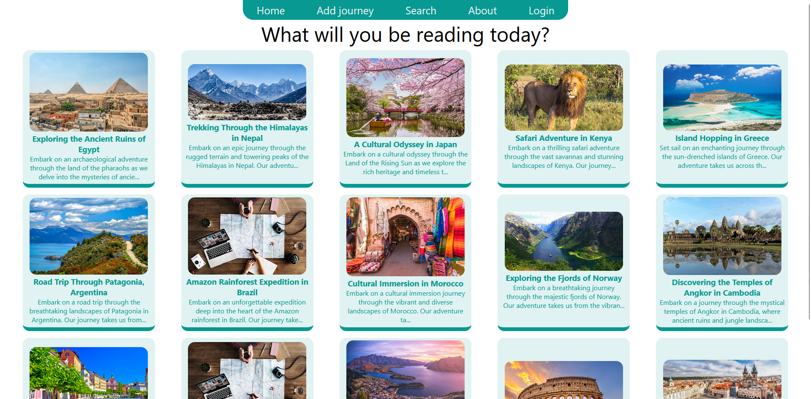
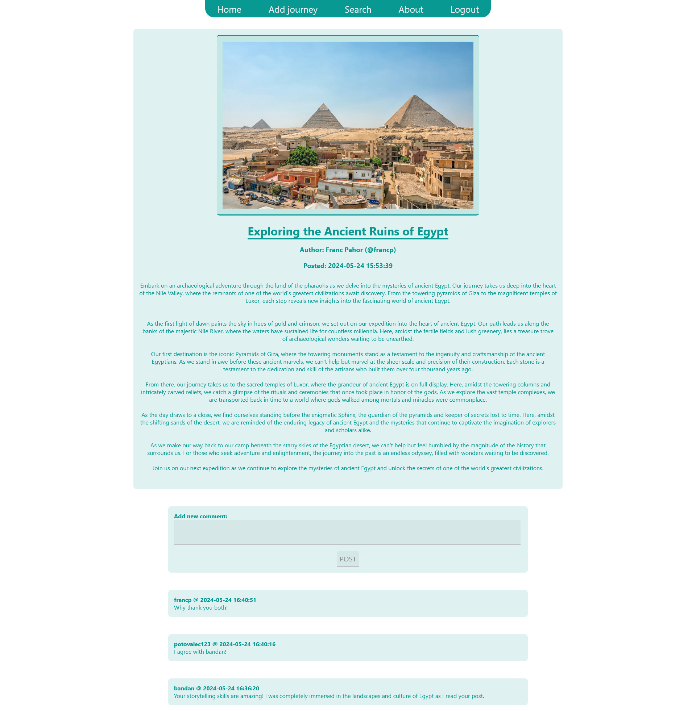
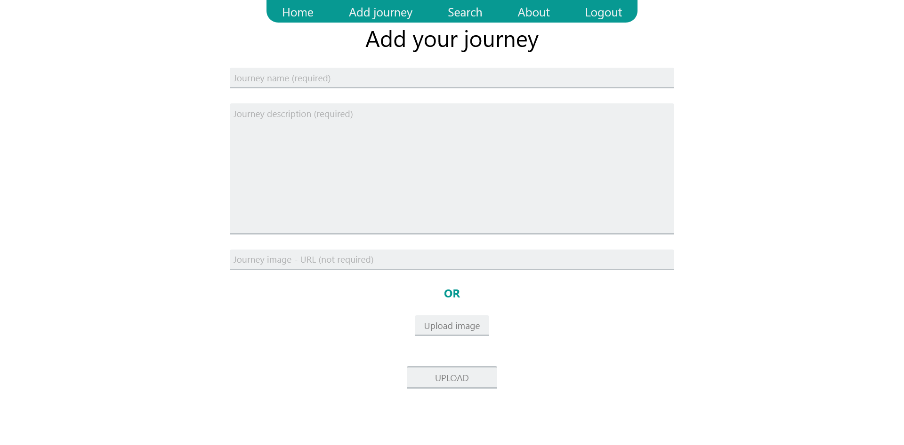

# Journee

A web app for sharing exploration discoveries, made in PHP.
For more information, please refer to ```docs``` folder.

(Demo website will be available shortly.)

#### About structure:

```src``` folder contains source code written in PHP, version 8. Place this in your desired web server folder.

```sql``` folder contains SQL statements used to generate database for the app. No dummy data is provided.

```docs``` folder contains information further describing the installation, as well as a ```.pdf``` file which is written more formally.

#### How to install:

Please refer to section [install](docs/install.md).

#### Screenshots:


---



---



